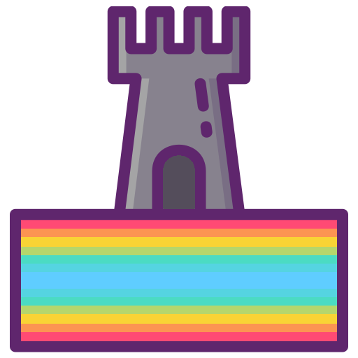

# Heimdall Agent - VS Code AI Assistant Hub

Heimdall Agent is a powerful VS Code extension that serves as a unified interface for multiple AI assistants, intelligently routing your queries to the most appropriate AI model based on context.



## Features

- **Multi-Model Support**: Integrates with multiple AI models:
  - Claude (Anthropic) for general assistance and complex reasoning
  - DeepSeek for code-specific tasks and optimizations
  - Aider for Git-aware coding assistance
 
- **Smart Model Selection**: Automatically chooses the best AI model based on:
  - Query content and context
  - Current file type
  - Git repository status
  - Selected code

- **VS Code Integration**:
  - Sidebar chat interface
  - Context-aware responses
  - Code snippet handling
  - Git status integration
  - Workspace awareness

## Requirements

- VS Code 1.60.0 or higher
- API keys for the following services:
  - Anthropic Claude API
  - DeepSeek API
  - (Optional) Aider setup for local execution

## Installation

1. Install from VS Code Marketplace or download the `.vsix` file
2. Configure API keys in VS Code settings:
   ```json
   {
     "heimdall.claude.apiKey": "your-claude-api-key",
     "heimdall.deepseek.apiKey": "your-deepseek-api-key",
     "heimdall.aider.endpoint": "local" // for local Aider execution
   }
   ```

## Usage

### Basic Commands

- Open Heimdall sidebar: Click the Heimdall icon in the activity bar
- Send a message: Type in the chat box and press Enter or click Send
- Model Selection:
  - `claude your-prompt`: Force Claude model
  - `deepseek your-prompt`: Force DeepSeek model
  - `aider your-prompt`: Force Aider model
  - `your-prompt`: Let Heimdall choose the best model

### Examples

```text
# General queries (auto-routes to Claude)
What's the time complexity of quicksort?

# Code-specific queries (auto-routes to DeepSeek)
Fix the bug in this function
Optimize this loop for performance

# Git operations (auto-routes to Aider)
Create a commit for these changes
Review my PR changes
```

## Development

### Setup

1. Clone the repository
2. Install dependencies:
   ```bash
   npm install
   ```
3. Build the extension:
   ```bash
   npm run compile
   npm run build:webview
   ```

### Debug

1. Open in VS Code
2. Press F5 to start debugging
3. Use "Developer: Reload Window" command if needed

### Project Structure

- `src/`: Source code
  - `heimdallCore.ts`: Core logic and model selection
  - `apiHandler.ts`: API communication
  - `workspaceHandler.ts`: VS Code workspace integration
  - `webview/`: Chat interface components
  - `utils/`: Helper utilities
  - `types/`: TypeScript definitions

## Contributing

1. Fork the repository
2. Create a feature branch
3. Commit your changes
4. Push to the branch
5. Submit a Pull Request

## License

[MIT License](LICENSE)

## Acknowledgments

- VS Code Extension API
- Anthropic Claude
- DeepSeek AI
- Aider
- React
- TypeScript

## Support

For issues and feature requests, please use the GitHub Issues page.

---

Made by Christopher Olson
